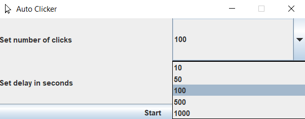

# Auto Clicker

General use Auto Clicking bot made with Java.

Dropdown box to set number of clicks and delay in seconds.

Confirmation message to start auto clicking.

<h2>Screenshots</h2>

1. Auto Clicker main screen.

2. Dropdown box to set the amount of clicks.

3. Dropdown box to set the delay in seconds.

4. Confimation for auto clicking to start in five seconds.

5. Success message after the bot has finished clicking.

